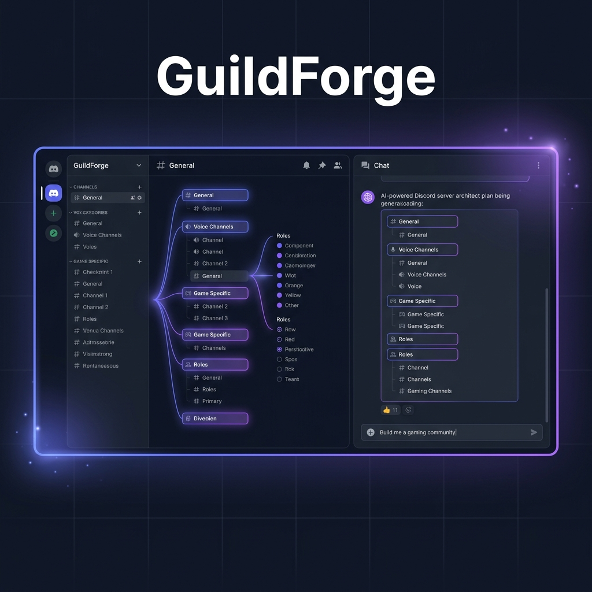
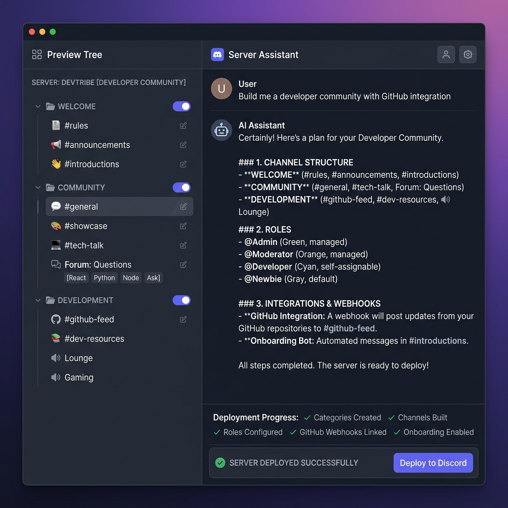

<div align="center">
  
  
  <h1>GuildForge</h1>
  <h3>AI-Powered Discord Server Architect</h3>
  <p><em>Describe your community in plain English. Watch it deploy in 60 seconds.</em></p>

  <br />

  <a href="https://github.com/MayonaiseLover/GuildForge/actions/workflows/ci.yml"></a>
  <a href="https://github.com/MayonaiseLover/GuildForge/blob/master/LICENSE"></a>
  <a href="https://github.com/MayonaiseLover/GuildForge/stargazers"></a>
  
  
  
  
  <a href="https://mayonaiselover.github.io/GuildForge/"></a>

  <br /><br />

  
</div>

<br />

> **GuildForge** is an enterprise-grade tool that converts natural language prompts into fully-deployed, production-ready Discord servers — channels, forums, roles, permissions, AutoMod, webhooks, embeds, and bot integrations — all in under a minute.

<br />

<div align="center">
  <table>
    <tr>
      <td align="center"><strong>🎯 Prompt</strong></td>
      <td align="center"><strong>📊 Output</strong></td>
      <td align="center"><strong>⏱️ Time</strong></td>
    </tr>
    <tr>
      <td><em>"An NFT community with verification gates and holder-only alpha channels"</em></td>
      <td>14 channels · 8 roles · verification gate · AutoMod</td>
      <td><code>~38s</code></td>
    </tr>
    <tr>
      <td><em>"A competitive gaming server with locked team voice channels and LFG"</em></td>
      <td>18 channels · 6 voice rooms · team roles</td>
      <td><code>~42s</code></td>
    </tr>
    <tr>
      <td><em>"A software dev community with GitHub webhooks and tech-stack roles"</em></td>
      <td>22 channels · 3 forums · webhooks · 14 embeds</td>
      <td><code>~51s</code></td>
    </tr>
    <tr>
      <td><em>"A college study group with Math, Physics, and CS channels"</em></td>
      <td>11 channels · subject roles · study voice rooms</td>
      <td><code>~29s</code></td>
    </tr>
  </table>
</div>

<br />

<div align="center">
  
  <br />
  <sub>Preview Tree + AI Chat — inspect every channel, role, and permission before deploying</sub>
</div>

<br />

## ✨ Features

<table>
<tr>
<td width="33%">

#### 🏗️ Smart Architecture
Categories, text/voice/forum channels with tags & guidelines — generated from a single prompt

</td>
<td width="33%">

#### 🛡️ Native Security
AutoMod rules, verification gates, content filters — built into Discord, zero third-party bots

</td>
<td width="33%">

#### 🤖 Bot Ecosystem
12-bot catalog with **granular permissions** (never admin) and one-click invite panels

</td>
</tr>
<tr>
<td>

#### 🎨 Rich Content
Welcome embeds, rules, contributing guides, ticket systems — posted automatically on deploy

</td>
<td>

#### 🔗 Webhook Integration
GitHub, CI/CD, changelog feeds — pre-configured with correct payloads and target channels

</td>
<td>

#### 🔄 Instant Rollback
Snapshot your entire server state before changes — one-click revert if anything goes wrong

</td>
</tr>
<tr>
<td>

#### 🧠 Multi-LLM Engine
6 AI providers — Anthropic, OpenAI, Gemini, Groq, Grok, DeepSeek — hot-swap via env config

</td>
<td>

#### 📊 Live Monitoring
Server health checks, custom alert rules, real-time Prometheus metrics & Discord DM alerts

</td>
<td>

#### 👥 Team Workspaces
Multi-user collaboration with role-based access, invites, and shared guild management

</td>
</tr>
</table>

<br />

## 🏛️ Architecture

```
┌──────────────────────────────────────────────────────────────────┐
│  Frontend — Next.js 16 · React 19 · Framer Motion              │
│  Landing · Dashboard · Preview Tree · Deploy · Analytics        │
│  8 routes × error boundary × loading skeleton = 100% covered    │
└────────────────────────────┬─────────────────────────────────────┘
                             │ REST + SSE (real-time deploy logs)
┌────────────────────────────┴─────────────────────────────────────┐
│  API — Fastify 5 · Prisma · PostgreSQL · Lucia Auth             │
│  OAuth → LLM Agent → Plan → Validate → Execute → Monitor       │
│  91 tests · Prometheus metrics · structured JSON logging        │
└────────────────────────────┬─────────────────────────────────────┘
                             │ Model Context Protocol (MCP)
┌────────────────────────────┴─────────────────────────────────────┐
│  MCP Server — discord.js 14 · Zod · 20+ callable tools         │
│  Channels · Roles · Forums · AutoMod · Webhooks · Embeds        │
│  Snapshots · Bot Panels · Templates · Restore                   │
└────────────────────────────┬─────────────────────────────────────┘
                             │
┌────────────────────────────┴─────────────────────────────────────┐
│  Multi-LLM Provider Registry                                    │
│  Anthropic · OpenAI · Gemini · Groq · Grok · DeepSeek           │
│  Hot-swap via LLM_PROVIDER env — zero code changes              │
└──────────────────────────────────────────────────────────────────┘
```

<br />

## 📦 Standalone MCP Server

Use the Discord MCP server independently with **Claude Desktop**, **Cursor**, **Cline**, or any MCP-compatible client:

```bash
npx @guildforge/mcp-discord
```

<details>
<summary><strong>📋 Available Tools (20+)</strong></summary>
<br />

| Tool | Description |
|------|-------------|
| `create_category` | Channel category with position & permissions |
| `create_text_channel` | Text channel with topic, slowmode, NSFW |
| `create_voice_channel` | Voice channel with bitrate & user limits |
| `create_forum_channel` | Forum with tags, guidelines, default reactions |
| `create_role` | Role with color, permissions, hoist & mentionable |
| `update_permissions` | Fine-grained permission overwrites per role/channel |
| `configure_automod` | Keyword filters, spam protection, mention limits |
| `setup_welcome_screen` | Welcome screen with channel descriptions & emoji |
| `configure_server` | Server-level settings (verification, content filter) |
| `create_webhook` | Webhook for external integrations (GitHub, CI/CD) |
| `send_embed` | Rich embed messages with fields, colors, thumbnails |
| `post_bot_invite_panel` | Bot catalog with permission-scoped invite links |
| `snapshot_guild` | Capture full server state for rollback |
| `restore_snapshot` | Restore server to a previous snapshot |
| `create_forum_post` | Seed forums with starter content |

</details>

<br />

## 🚀 Quick Start

### Prerequisites

| Requirement | Version |
|-------------|---------|
| Node.js | 20+ |
| pnpm | 11+ |
| PostgreSQL | 16+ (or `docker compose up -d db`) |
| [Discord Bot](https://discord.com/developers/applications) | Bot token + server members intent |

### Install & Run

```bash
# 1. Clone
git clone https://github.com/MayonaiseLover/GuildForge.git && cd GuildForge

# 2. Install
pnpm install

# 3. Configure
cp .env.example .env
# Fill in your Discord + AI provider credentials

# 4. Database
docker compose up -d db
npx prisma migrate deploy

# 5. Launch
pnpm dev
```

Open **[localhost:3000](http://localhost:3000)** — the dashboard is ready.

### Environment Variables

| Variable | Required | Description |
|----------|:--------:|-------------|
| `DATABASE_URL` | ✅ | PostgreSQL connection string |
| `SESSION_SECRET` | ✅ | ≥32-char random string — AES-256-GCM token encryption |
| `DISCORD_CLIENT_ID` | ✅ | OAuth application client ID |
| `DISCORD_CLIENT_SECRET` | ✅ | OAuth application client secret |
| `DISCORD_BOT_TOKEN` | ✅ | Bot token with Administrator permission |
| `API_URL` | ✅ | Public API URL (e.g. `https://api.yourdomain.com`) |
| `WEB_URL` | ✅ | Public web URL (e.g. `https://yourdomain.com`) |
| `NEXT_PUBLIC_API_URL` | ✅ | Same as `API_URL` — injected into Next.js client |
| `LLM_PROVIDER` | | Default: `anthropic` — also: `openai`, `gemini`, `groq`, `grok`, `deepseek` |
| `ANTHROPIC_API_KEY` | ⚡ | Required if using Anthropic (default provider) |
| `OPENAI_API_KEY` | | Required if using OpenAI |
| `GEMINI_API_KEY` | | Required if using Gemini |
| `GROQ_API_KEY` | | Required if using Groq |
| `GROK_API_KEY` | | Required if using Grok |
| `DEEPSEEK_API_KEY` | | Required if using DeepSeek |
| `SENTRY_DSN` | | Optional — error tracking (structured stderr fallback) |

### Production Deployment

```bash
# Docker Compose (recommended)
docker compose --env-file .env.prod up -d

# Or deploy individually — see docs/DEPLOYMENT.md for:
#   • Railway  • Fly.io  • Docker + Nginx SSL
```

> 📖 Full deployment guide → **[docs/DEPLOYMENT.md](docs/DEPLOYMENT.md)**

<br />

## 📁 Project Structure

```
GuildForge/
├── apps/
│   ├── web/                     # Next.js 16 frontend
│   │   ├── src/app/             # App Router — 10 pages, 100% error/loading coverage
│   │   ├── src/components/      # PreviewTree, ChatPanel, FormWizard, ErrorBoundary
│   │   └── e2e/                 # Playwright smoke tests (7 specs)
│   ├── api/                     # Fastify 5 backend
│   │   ├── src/routes/          # 19 route handlers (auth, plans, guilds, monitoring)
│   │   ├── src/services/        # Agent orchestrator, LLM registry, alert delivery
│   │   ├── src/plugins/         # Prisma, Lucia, Prometheus metrics
│   │   └── tests/               # 61 tests (routes, auth, crypto, agent, monitoring)
│   └── mcp-discord/             # Standalone MCP server
│       ├── src/tools/           # 20+ Discord API tool implementations
│       └── tests/               # 5 tests (client, rate-limit, tools)
├── packages/
│   ├── plan-schema/             # Shared BuildPlan Zod schemas
│   └── shared-types/            # Bot catalog + type definitions
├── prisma/                      # 21 models, strategic indexes, cascade deletes
├── docs/                        # Deployment, rate limiting, self-hosting
└── .github/workflows/           # CI: lint → typecheck → audit → test → E2E → build
```

<br />

## 🧪 Quality

```
╔══════════════════════════════════════════════════════════╗
║  91 tests across 24 test files                          ║
║  ├── API:  61 tests (routes, auth, agent, monitoring)   ║
║  ├── Web:  25 tests (components, error boundaries)      ║
║  └── MCP:   5 tests (client, rate-limit, tools)         ║
║                                                          ║
║  + 7 Playwright E2E smoke tests                          ║
║                                                          ║
║  ✅ TypeScript strict — 0 errors                         ║
║  ✅ ESLint — 0 errors, 0 warnings                       ║
║  ✅ pnpm audit — 0 HIGH/CRITICAL vulnerabilities        ║
║  ✅ Build — 6/6 packages compile successfully            ║
╚══════════════════════════════════════════════════════════╝
```

### Security Posture

| Control | Status |
|---------|:------:|
| Helmet security headers | ✅ |
| CORS locked to `WEB_URL` | ✅ |
| Rate limiting (120/min + per-route AI limits) | ✅ |
| Session HMAC-SHA256 + AES-256-GCM | ✅ |
| httpOnly + secure + sameSite cookies | ✅ |
| Non-root Docker containers | ✅ |
| Structured JSON logging (zero console.*) | ✅ |
| Prometheus metrics (`/metrics`) | ✅ |
| Sentry integration (optional) | ✅ |
| CI security audit gate (blocks HIGH) | ✅ |

<br />

## 🤝 Contributing

Contributions are welcome. Please read **[CONTRIBUTING.md](CONTRIBUTING.md)** first.

```bash
# Fork → Clone → Branch → Code → Test → PR
git checkout -b feat/your-feature
pnpm test && pnpm lint && pnpm typecheck
git commit -m "feat: your feature"
git push origin feat/your-feature
```

<br />

## 📄 License

MIT — see **[LICENSE](LICENSE)** for details.

<br />

---

<div align="center">
  <sub>Built with ⚔️ by <a href="https://github.com/MayonaiseLover">MayonaiseLover</a></sub>
  <br />
  <sub>Powered by Claude · GPT-4o · Gemini · Groq · Discord.js · Next.js · Fastify</sub>
  <br /><br />
  <a href="CODE_OF_CONDUCT.md">Code of Conduct</a> · <a href="SECURITY.md">Security Policy</a> · <a href="docs/DEPLOYMENT.md">Deployment Guide</a>
</div>
